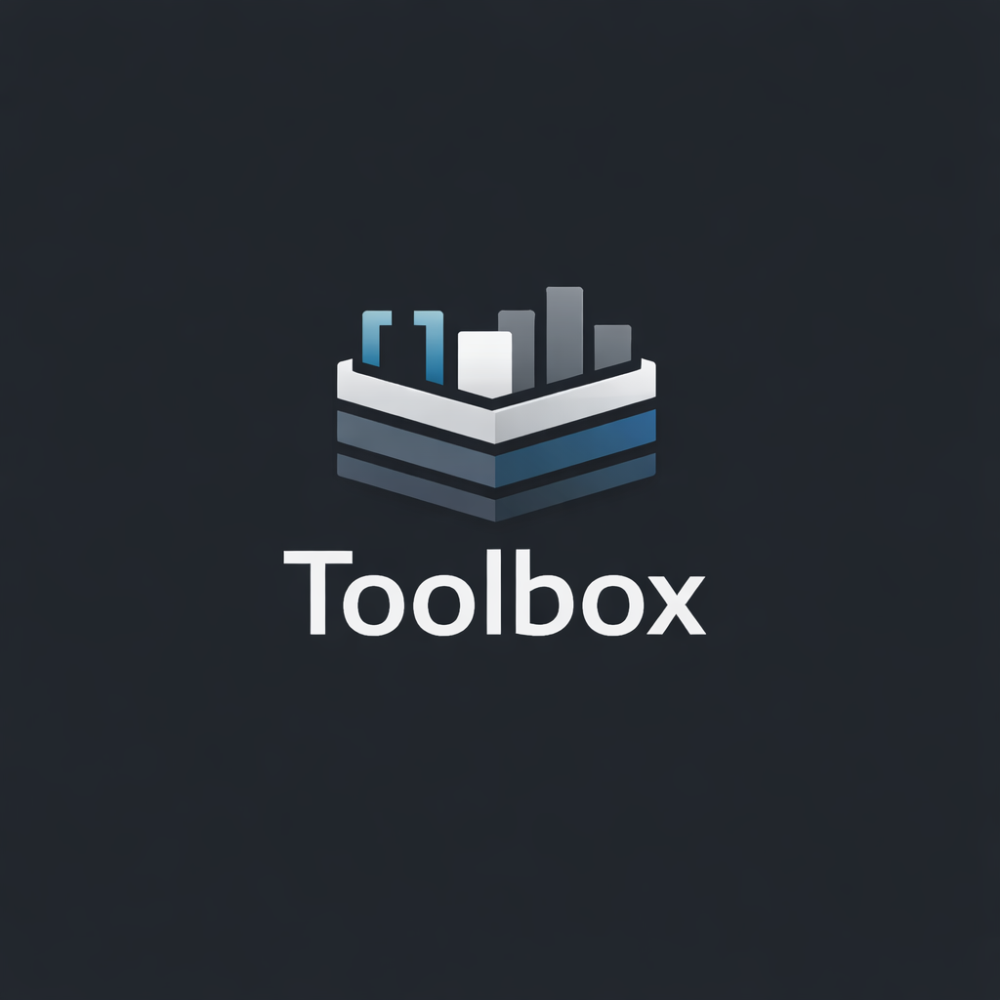

<p align="center">
  
</p>

# 🌌 Universal Toolkit Web: The Ultimate Agentic Toolkit

A comprehensive, highly extensible, and blazing-fast web-based toolbox for developers, designers, and creators. Built with modern web technologies, it features a plug-and-play modular architecture.

[](https://nextjs.org/)
[](https://tailwindcss.com/)
[](https://opensource.org/licenses/MIT)

## Table of Contents

- [🚀 Quick Start](#quick-start)
- [🛠️ Installation](#installation)
- [📦 Features](#features)
- [🏗️ Architecture](#architecture)
- [🤝 How to Contribute](#how-to-contribute)
- [💬 Community & Support](#community--support)
- [👥 Repo Contributors](#repo-contributors)
- [⚖️ License](#license)
- [🌟 Star History](#star-history)

---

## 🚀 Quick Start

```bash
# Clone the repository
git clone https://github.com/quoctang/universal-toolkit.git

# Navigate to the web microservice
cd universal-toolkit/microservices/universal-toolkit-web

# Install dependencies and run locally
pnpm install
pnpm dev
```

👉 Open [http://localhost:3000](http://localhost:3000)

---

## 🛠️ Installation

### Prerequisites

- Node.js v20+
- pnpm v9+

| Command      | Action                       |
| :----------- | :--------------------------- |
| `pnpm dev`   | Start development server     |
| `pnpm build` | Build for production         |
| `pnpm start` | Run production build locally |
| `pnpm lint`  | Run ESLint                   |

---

## 📦 Features

Our toolbox includes multiple developer and design utilities in an isolated "Plug-and-play" fashion:

| Tool Category    | Tool Name        | Features                       | Status    |
| :--------------- | :--------------- | :----------------------------- | :-------- |
| **Developer**    | `JSON Formatter` | Format, minify, validate JSON  | 🟢 Active |
| **Developer**    | `Base64 Encoder` | Encode/Decode, Auto-swap       | 🟢 Active |
| **Design**       | `Color Picker`   | RGB/HEX/HSL, Tailwind Palettes | 🟢 Active |
| **Productivity** | `MD to DOCX`     | Convert Markdown to MS Word    | 🟢 Active |
| **System**       | `Settings`       | Global configuration module    | 🟢 Active |

---

## 🏗️ Architecture

The core architecture is heavily modularized within `microservices/universal-toolkit-web`. Tools are instantiated dynamically off a `features/` directory through our **Tool Registry Pattern**.

```text
universal-toolkit/
├── agent/skills/                      # AI Agent Skills (e.g. awesome-readme)
├── docs/                              # Project Documentation (PRDs)
└── microservices/universal-toolkit-web/
    ├── app/                           # Next.js App Router
    ├── core/                          # Providers, Layouts, Tool Registry
    └── features/                      # Isolated tool modules
```

---

## 🤝 How to Contribute

We welcome contributions from the community! To add a new tool or feature:

1. **Fork** the repository.
2. **Create a new branch** (`git checkout -b feature/awesome-new-tool`).
3. Build your tool in `features/[tool-name]` and update `config/tools.ts`.
4. **Submit a Pull Request**.

Please ensure your tool includes an isolated ErrorBoundary and follows our UI/UX framework.

---

## 💬 Community & Support

Support the project and keep it completely open-source:

- Star the repository on GitHub ⭐
- Share this toolkit with your colleagues!
- Open issues or feature requests in the Issues tab.

---

## 👥 Repo Contributors

<a href="https://github.com/quoctang/universal-toolkit/graphs/contributors">
  
</a>

Made with [contrib.rocks](https://contrib.rocks).

Thank you to everyone who has contributed to making this toolbox awesome!

---

## ⚖️ License

MIT License. See [LICENSE](LICENSE) for details.

---

## 🌟 Star History

[](https://star-history.com/#quoctang/universal-toolkit&Date)
